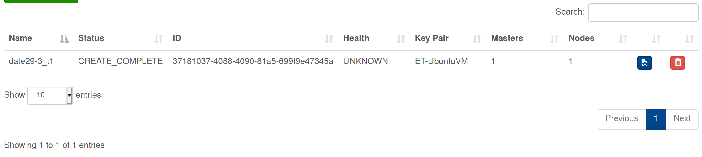
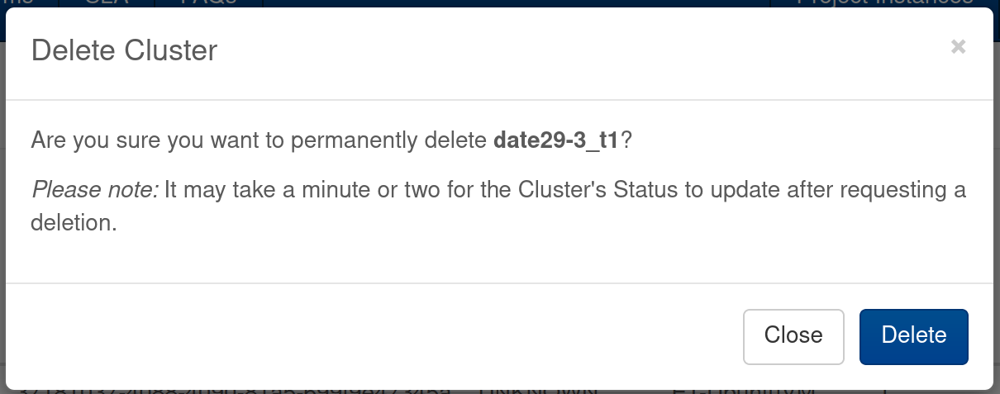
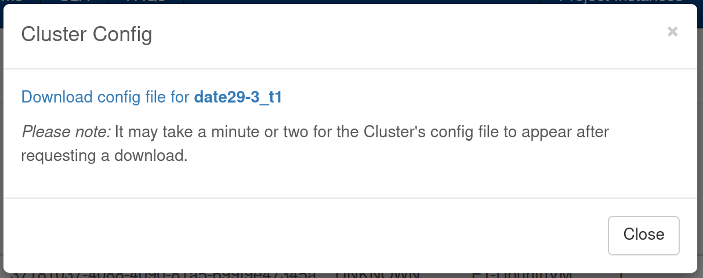

==============================
Clusters Page (SCD Cloud Site)
==============================

This documentation refers to the Clusters Page of the SCD Cloud Site.

At the time of writing, this page is only in a development `branch`_.

Introduction
############

The Clusters Page is an extension to the SCD Cloud Site.
It allows users to `Display`_, `Create`_, `Delete`_, and `Download Config`_ of `Magnum`_ clusters associated with the selected project.

The Clusters page is designed to be very similar to the (pre-existing) Machines page.
See comparison below:

Clusters page *(new)*
*********************

.. image:: images/clusters-page.png
    :alt: Screenshot of the entire Clusters page

Machines page *(pre-existing)*
*******************************

.. image:: images/machines-page.png
    :alt: Screenshot of the entire Machines page

Code design
###########

In extending the existing code, I have tried to balance conforming to the existing style with making the code simple and concise.

    **Important:**  This extension was developed in Python3.9

    `Tweaks <https://github.com/stfc/cloud/commit/e9adb9d2004347227e7649514ff41f83d5197d64>`_ were made to get the existing code to run in this version.

    *Before deploying* this extension: Not only will these tweaks need to be reverted, but additional tweaks may be required to make the new code compatible with the production python environment.

As an overview of it's structure:

* The Clusters page follows a MVC (Model-View-Controller) design pattern (as established by the codebase previously).
* A *HTML* page is served to the user using *CherryPy*.
* *JavaScript* is used for interactivity, to submit *Ajax* requests to the *Python* backend API, and handle the data returned.
* The API objects are mounted onto ``/api``. This `branch`_ adds ``/cluster``, ``/clustertemplate``, and ``/clusterconfig``

Features
########
The Cluster page works in much the same way as the Machines page. It's key features (`Display`_, `Create`_, `Delete`_, and `Download Config`_) are outlined below:

Display
********
The page displays the Clusters associated with the selected project.

The selected project can be changed using the *'Current Project'* dropdown menu at the top right of the page.

This table is set to *automatically update* itself every 1 minute.

To change the headings, see `Editing the cluster table's headings`_.

The cluster data for this table is provided by the method:

.. code-block:: Python3

    magnumclient.client.clusters.list()

Create
*******
The ‘New Cluster’ button opens a cluster creation modal.

.. image:: images/create-cluster-modal.png
  :alt: Screenshot of the Create Cluster modal

Selecting the *'Template Default'* flavour in the master/node dropdown uses the master/node flavour specified by the selected cluster template.

To change the user input fields, see `Editing the cluster creation fields`_.

The list of cluster templates is provided by the method:

.. code-block:: Python3

    magnumclient.client.cluster_templates.list()

Delete
*******
The delete button on each row of the cluster table opens a cluster deletion modal.

This modal just acts as a confirmation.

The deletion request is passed to the method:

.. code-block:: Python3

    magnumclient.client.clusters.delete(cluster_to_delete_uuid)

Download Config
****************
The config download button on each row of the cluster table opens a modal which offers the user to download the config file for the given cluster.

Within the scope of this project, a method within the OpenStack SDK to retrieve a given cluster’s config file *could not be found*.

As a workaround_, this functionality is implemented using the ``subprocess`` python library to call the equivalent OpenStack CLI command:

.. code-block:: bash

    openstack coe cluster config <cluster-uuid>

Where this workaround code is called (within the ClusterConfig_ object), a temporary directory is created to store the config file.

From here, the config file is served to the user to save or open, whereby the temporary directory is implicitly deleted.

How Tos
#######
This section contains walk-throughs for editing the page.

Editing the cluster table's headings
************************************
The current headings, at time of writing, are copied from OpenStack Horizon’s *Container Infra: Clusters page*.

The headings can be easily changed by *simply adding/removing columns* to the `clusterTable`_.

Each column's ``data`` attribute must match a cluster attribute.

*To see possible cluster attributes*: If you have logged in to the cloud site, and have at least one cluster within your selected project, you can navigate to ``/api/cluster`` to see the raw data for your cluster(s).

Editing the cluster creation fields
***********************************
The fields taken by the modal can be edited in a of couple steps:

1. Edit ``create-modal.html``
    If *removing* a field, simply delete it's HTML block.

    If *adding* a field, create a HTML block with the desired input type (e.g. ``<select>``, ``<input>``).
    This code can largely be duplicated from the HTML blocks of existing fields.

2. Edit ``create-cluster.js``
    Within ``submitClusterForm()``, the ``formData`` dictionary will need to be edited.

    If *removing* a field, simply delete it's entry.

    If *adding* a field, create a new entry.
    The *value* can be retrieved from the HTML using jQuery (the code for this can be copied from the existing fields).
    The *key* for each entry must be one of the following:

    ``name``, ``node_count``, ``discovery_url``, ``master_count``, ``baymodel_id``, ``bay_create_timeout``, ``cluster_template_id``, ``create_timeout``, ``keypair``, ``docker_volume_size``, ``labels``, ``master_flavor_id``, ``flavor_id``, ``fixed_network``, ``fixed_subnet``, ``floating_ip_enabled``, ``merge_labels``, ``master_lb_enabled``

Other small changes
###################
Within the `branch`_ containing this extension I have made a few other small changes to the code base.

1. `Refactor OpenStack session duplication <https://github.com/stfc/cloud/commit/6b1a39555c8f98cf31435ed61bb87390fbeb1ed7>`_
    I noticed the code for retrieving an openstack session was *duplicated* in instances where a project_id was provided.
    
    I refactored the existing ``getOpenStackSession()`` method to handle these cases whilst maintaining it’s backwards compatibility.
    
2. `Refactor hostname retrieval <https://github.com/stfc/cloud/commit/04bb02a7b4483cfcf418073aa01716fc30814881>`_
    I saw an *opportunity to simplify* a section of code that wasn’t working as expected in my python version.

    The code appeared to be for retrieving the first hostname from a dictionary.
    The existing implementation involved converting the dictionary to a string and using an assumed starting index (which was incorrect in my version) along with a regex to extract the desired value.
        
    I updated this to simply return the first value in the dictionary, and added a code comment.

3. `Fix Rename modal <https://github.com/stfc/cloud/commit/c1ee299de3abeb4ebf6fd15d3c67f26838d1c5ba>`_
    I resolved issue `#121`_

    This was simply *setting the modal to 'hide'* after clicking 'Rename'.

4. `Renamed tabs <https://github.com/stfc/cloud/commit/bd31516dd6bcc04d4823e9a643f2b3cc6ef40743>`_ 
    I renamed the tabs for the Machines and Clusters pages to *Project Instances* and *Project Clusters* respectively, following a discussion about the names in `#120`_.

Opportunities for extension
###########################
Due to the limited scope of this project, there are a few features I have not implemented that I believe would be the best next steps.

1. Proper error handling
    Currently the only error handling the Clusters page provides is displaying the text *"The backend didn't like that.. "* in red when a Create Cluster attempt results in a 400 or 500 error.

2. Other cloud platforms
    Whereas the Machines page is built to handle multiple cloud platforms (OpenStack and OpenNebula), the Clusters page is currently *built only to handle OpenStack*.

3. Inheritance
    In pursuit of cohesion between the Machines page and Clusters page, much of the former’s code has been copied into the latter. This has resulted in considerable duplication.
    
    As such, there are *opportunities* to make the overall code *more concise* by refactoring this duplication into shared base files.

.. _Magnum: https://docs.openstack.org/magnum/latest/user/
.. _branch: https://github.com/stfc/cloud/tree/clusters-page
.. _clusterTable: https://github.com/stfc/cloud/blob/clusters-page/assets/js/clusters/get-clusters.js
.. _workaround: https://github.com/stfc/cloud/commit/daa425495063022854ea68d837247aa0307a9036
.. _ClusterConfig: https://github.com/stfc/cloud/blob/clusters-page/controllers/api/openstack/cluster_config.py
.. _`#121`: https://github.com/stfc/cloud/issues/121
.. _`#120`: https://github.com/stfc/cloud/pull/120
